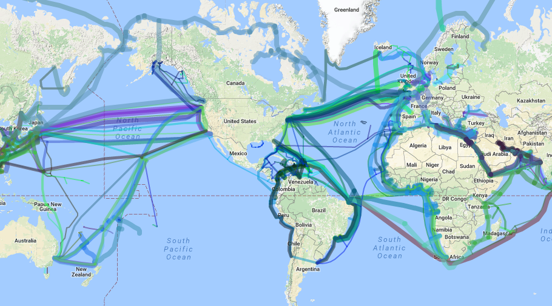
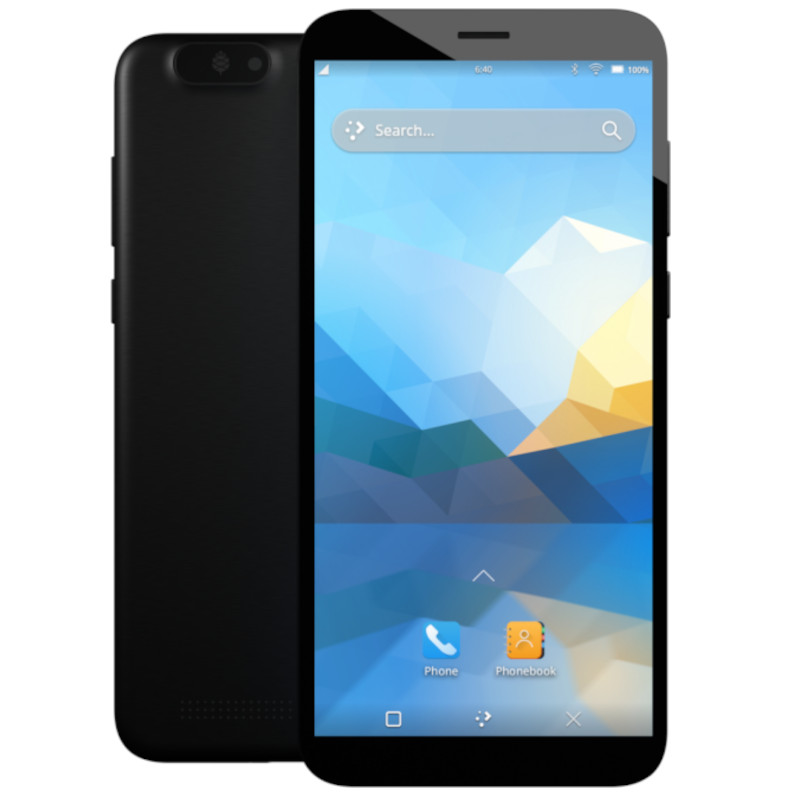
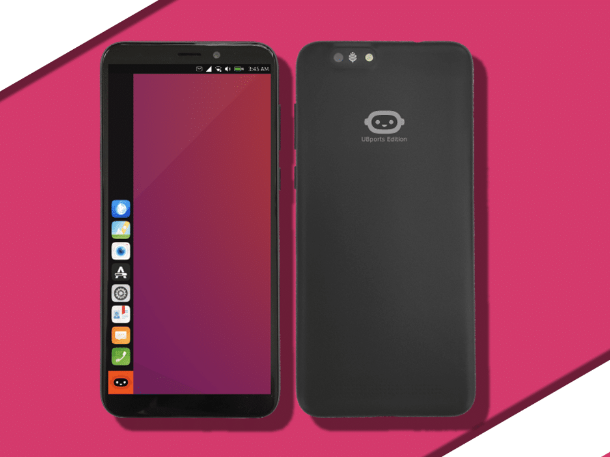
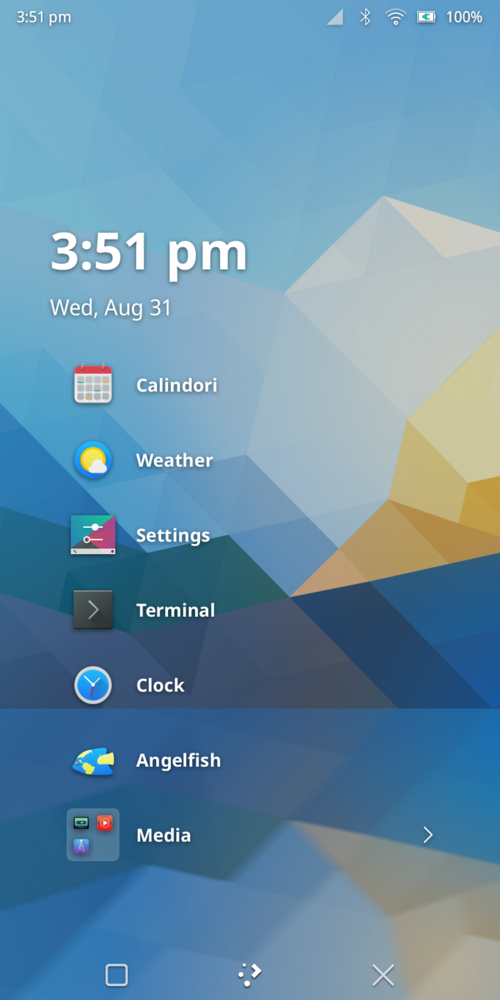

#  From User to Owner: The Journey to Open Source Smartphone OS

## What we shall talk about

-----------

- Why and how to make the switch

## The Internet

-----------

## Things can change fast

-----------

## Privacy

### The start of privacy

-----------

### Why privacy is important

-----------

### Why we have no privacy today

-----------

## My journey to find a good phone for me

-----------

[Flip phone](https://www.hmd.com/en_us/nokia-2780-flip?sku=16WNDR11A01)

[Light Phone](https://www.thelightphone.com/shop/products/light-phone-ii-light-gray)

[Astro slide](https://store.planetcom.co.uk/products/astro-slide)

[Volla](https://volla.online/en/volla-phone-x23/)

[Pinephone](https://pine64.org/devices/pinephone_pro/)

[LineageOS](https://lineageos.org/)

[CalyxOS](https://calyxos.org/)

[Ubuntu Touch](https://ubuntu-touch.io/get-ubuntu-touch)

[Fairphone](https://shop.fairphone.com/fairphone-4)

[Plasma Mobile](https://www.plasma-mobile.org/)

## GrapheneOS

-----------

### Graphene is only for phones Pixel phones what!!!
- Better support
- Better security
  - Titan M2 chip
  - Tensor security core
  - Android Verified Boot 2.0
    - Allows you to verify the boot process even with other OSs
- Pixels are made to support alternative OSs
- Long term firmware updates from google
- Memory Tagging

### Good Defaults
- Per-connection randomized MAC
- Attestation key provisioning
  - Proxy between you and google so google can still check on the validity of your phone but google gets none of your infomation
- Clear logs after 10 days
- Sandbox apps
- Disable persistent cookies
- Airplane mode really turns off all radios
- You are the admin user!
- No Google! (unless you want it)
- Auditor app
- Get apps with Aurora Store or F-Droid

### Make GrapheneOS even better
- Disable 2G
- Turn off Network Time
- Have bluetooth and wifi turn off after a certain time
- Set up DNS or VPN (but not both!)
  - [Mullvad](https://mullvad.net/en/)
  - [ProtonVPN](https://proton.me/)
  - [Quad9](https://www.quad9.net/)
- Screen time out
- Auto Reboot
- Disable access to camera, mic, sensors, location, storage, etc... for apps
  - Fine grain control over each apps permissions
- Use a password instead of a pin to unlock your phone

### Issues
- Carrier contracts!
  - OEM Lock
  - Cant unlock bootloader
- Refurbished phones
  - Can be OEM locked

## What apps do I use if I dont use any of FAANGs?

- Storage
  - [Nextcloud](https://nextcloud.com/)
  - [Piwigo](https://piwigo.org/)
  - [ProtonDrive](https://proton.me/)
  - [TutaDrive](https://tuta.com/)
  - [Synology](https://www.synology.com/en-us)
  - [SyncThing](https://syncthing.net/)
- Maps
  - [Organic Maps](https://organicmaps.app/)
- Email
  - [ProtonMail](https://proton.me/)
  - [Tuta](https://tuta.com/)
- Edit Documents on the web
  - [CryptPad](https://cryptpad.fr/)
- Messaging
  - [Signal](https://signal.org/)
- Music
  - [Band Camp](https://bandcamp.com/)
- Audio Books
  - [Voice](https://f-droid.org/en/packages/de.ph1b.audiobook/)
  - [LibriVox](https://librivox.org/)
- Podcasts
  - [AntennaPod](https://antennapod.org/)
- Videos
  - [Odysee](https://odysee.com/)
- Password Manager
  - [Bitwarden](https://bitwarden.com/)
  - [KeePass](https://keepass.info/)

## Next step for me

-----------

## Conclusion

-----------

